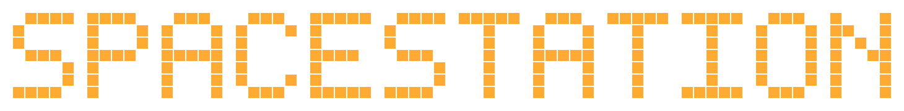

<div align="center">



**A living pixel-art station where real AI agents do real work.**

[](https://github.com/androoAGI/starnet-releases/releases/latest)
[](INSTALL.md)
[](LICENSE)
[](PRIVACY.md)

[Download](https://github.com/androoAGI/starnet-releases/releases/latest) ·
[Install guide](INSTALL.md) ·
[Run from source](#run-from-source) ·
[Docs](docs/INDEX.md) ·
[Contributing](CONTRIBUTING.md)


</div>

> **SpaceStation** is a fork of [StarNet](https://github.com/androoAGI/starnet) (MIT), renamed and
> rebranded. The upstream StarNet name, logo, and artwork remain Andrew Sims' — see [License](#license).

SpaceStation is a local-first desktop harness where you create AI agents, organize them into a
pixel-art space station, and watch them perform real work with real models and tools. The
station is not decoration — it is a projection of live runtime state, and the product contract
is literal: **A room is a capability-scoped team**, **a hallway is** an authorized handoff
lane, and **a placed object is a real capability grant**.
The layout you draw *is* the workflow the agents run.

Start with one agent, then place bays or summon specialists to run **more, concurrently** —
each a **genuinely distinct, bounded agent run** with its own workspace and permissions.
The harness performs **real model calls, real tools, real cost** rather than animating a
simulation.

## Features

| | |
| --- | --- |
| **A crew, not a chatbot** | Create agents with distinct classes, personas, and loadouts. Run several at once — each gets its own workspace, transcript, memory, and bounded permissions. |
| **Bring your own models** | Paste an OpenRouter key, or sign in with supported provider accounts (Anthropic, OpenAI, Google) — keys live in the OS keychain, never in the frontend. |
| **Message it from anywhere** | Wire agents to Telegram, Discord, Slack, Signal, or Matrix and talk to your station away from the desk. |
| **Night Shift** | Leave the station running and agents keep working inside an explicit, adjustable leash — every away-action is logged and reviewable. |
| **Recipes, skills, schedules** | Launch proven multi-step recipes, grant reusable skills, and put work on cron schedules with visible output. |
| **Asks before it guesses** | Task Briefs turn ambiguity into one concrete question with options — over any connected channel — instead of a silent wrong guess. |
| **Finished work has a front door** | Deliverables land in the OUTBOX as real files you open, not chat scrollback you archaeology. |
| **MCP connectors** | Attach Model Context Protocol servers and paste-a-key/OAuth connectors to extend what agents can touch. |
| **Voice** | Push-to-talk dictation in, one consistent station voice out. |
| **Real ledgers** | Spend, budgets, and run history persist on disk and are shown as-is. |

## What is real

- Model calls stream through the local Node sidecar.
- Tools operate through explicit capability and consent checks.
- Agent memory, transcripts, spend records, tasks, and schedules persist on disk.
- Multiple agents run concurrently with separate workspaces and bounded permissions.
- The visual station projects the same runtime state the harness can prove.

SpaceStation does not simulate revenue, completed work, model activity, or spend. Its core product
law is that **the interface must never assert state the harness cannot prove.**

## Download

Desktop builds are published on the
[releases page](https://github.com/androoAGI/starnet-releases/releases/latest).

| Platform | Asset |
| --- | --- |
| **Windows** (10/11, 64-bit) | `SpaceStation_<version>_x64-setup.exe` |
| **macOS — Apple Silicon** (M1–M4) | `SpaceStation_<version>_aarch64.dmg` |
| **macOS — Intel** | `SpaceStation_<version>_x64.dmg` |

> **Apple Silicon note:** use the native `aarch64` DMG. Avoid the `x64` DMG on Apple Silicon:
> it runs under Rosetta 2 rather than using the native architecture.

The public release train supports Windows and macOS. It refuses to stage a release unless the
Windows installer passes Authenticode and timestamp verification, both Mac builds pass
Developer ID checks and Apple notarization, and every updater artifact has a valid updater
signature. Those are pipeline requirements, not proof that a particular downloaded or installed
copy was tested on your machine; [INSTALL.md](INSTALL.md) explains what to verify and when to stop.
Linux packages are internal build artifacts only and are not a supported public release target.

> **Early release:** Windows is the most-tested desktop target. macOS has less real-world
> coverage. Broken? Tell us:
> **androo.agi@gmail.com**.

## Run from source

Requirements: Node.js 18+ (Node.js 22 matches CI), Git. Rust and the
[Tauri prerequisites](https://v2.tauri.app/start/prerequisites/) only for the desktop shell.

The sidecar uses Node core modules only, so it runs without installing anything:

```bash
git clone https://github.com/androoAGI/starnet.git
cd starnet
node sidecar/index.js
```

Open <http://localhost:8787>, then connect a provider —
**bring your own OpenRouter API key (BYOK)** or use a supported OAuth sign-in. Provider requests leave your machine when you run an agent;
station state, transcripts, memory, and ledgers stay in the local SpaceStation workspace unless you
explicitly use a network tool or connector. See [PRIVACY.md](PRIVACY.md) for the full data map.

For desktop development:

```bash
npm ci
npm run desktop:dev     # dev shell
npm run desktop:build   # build installers locally
```

## Coming from OpenClaw or Hermes?

SpaceStation can import an existing agent: point it at your on-disk OpenClaw or Hermes home and it
mints a SpaceStation agent from the persona, instructions, memory, and model it finds. API keys
never transfer — you re-enter those in the KEYS tab.

## Architecture

| Path | Responsibility |
| --- | --- |
| `frontend/` | Vanilla JavaScript station world and desktop UI. |
| `sidecar/` | Local Node agent runtime: providers, tools, persistence, budgets, consent. |
| `shared/` | Additive cross-boundary event and schema contracts. |
| `src-tauri/` | Rust/Tauri desktop shell and bundled runtime. |
| `test/` | Unit, contract, integration, and release gates. |
| `qa/` | Live QA receipts, journeys, findings ledger, and release-readiness authority. |

The frontend consumes real sidecar events over localhost HTTP/NDJSON and SSE. Secrets belong
to the local authority:
**Secrets are held by the sidecar / OS keychain, never in the frontend**.

Start with [docs/INDEX.md](docs/INDEX.md) for the living documentation. Older planning
documents remain in the repository as design history and are labeled accordingly.

## Testing

```bash
npm run test:fast          # required merge gate
npm run test:http          # live sidecar HTTP/E2E suite
npm test                   # validation + world + fast + HTTP suites
npm run security:secrets   # full-history secret scan; requires Gitleaks in PATH
```

The release aggregate is `npm run qa:ready`. It is candidate-bound: any new commit invalidates
the prior READY receipt until the affected live gates are rerun.

## Contributing and security

Contributions are welcome — read [CONTRIBUTING.md](CONTRIBUTING.md) and follow the
[Code of Conduct](CODE_OF_CONDUCT.md).

Do not report vulnerabilities in a public issue. Follow [SECURITY.md](SECURITY.md) for private
reporting instructions.

## License

SpaceStation is open source under the [MIT License](LICENSE). Third-party components remain
under their original licenses — see [NOTICE.md](NOTICE.md).

**The MIT License covers the code only.** The **StarNet** name, the logo, the station artwork
and sprites, and the rest of the upstream project's brand identity are owned by Andrew Sims and are
**not** licensed with it — no trademark or other brand rights are granted, expressly or by
implication.

MIT means you may fork, modify, and redistribute the code, including commercially. What you
may not do is ship it as StarNet: forks and derivatives must use their own name, logo, and
artwork, and must not present themselves as this project or as endorsed by it. **This fork does
exactly that — it ships as SpaceStation, under its own name and wordmark.**
